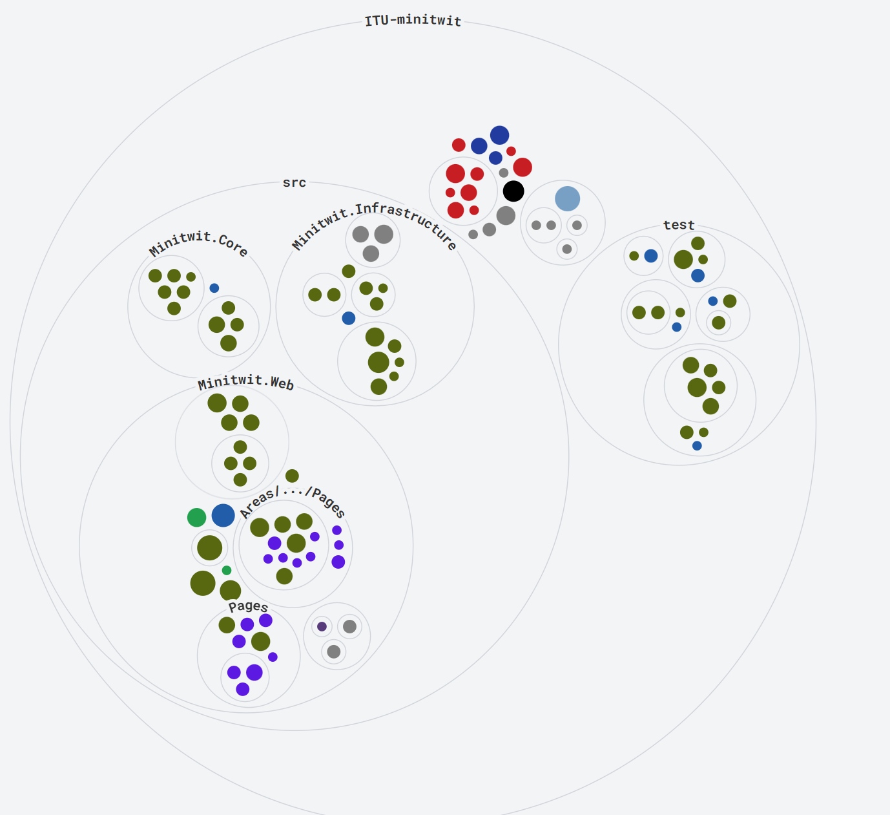

= Report - DevOps 2024 ITU
Casper Holten <casho@itu.dk>; Mads Andersen <madsd@itu.dk>; Magnus Kristensen <bekr@itu.dk>; Mikkel Kristensen <mbek@itu.dk>; Oliver Laursen <olau@itu.dk>
:title-page:
:appendix-caption:
:sectnums:
:toc:
:docdate: date (ISO)

== Introduction

During the DevOps, Software Evolution, and Software Maintenance course, we enhanced a 'Micro Blogging Service' from an earlier course to handle real-world user simulations. This process improved the application's durability, performance, and maintainability. We learned to create more efficient applications, implement robust CI/CD workflows, and use metrics, monitoring, and logging to maintain application health.

== System's Perspective
=== Design and Architecture of ITU-MiniTwit Systems

// Description and illustration of the design and architecture.

// Figures:
// SHOW THE ENTIRETY OF THE ARCHITECTURE(ZOOMED COMPLETELY OUT)
//SHOULD ACT AS THE BASIS FOR THE FIGURES BELOW (ZOOMED IN)
==== Overall Architecture

.Architecture Overview
image::Images/Architecture.png["System Architecture", align="center", width="70%]
The system architecture depicted in the figure 1 represents a CI/CD pipeline for deploying a software system.

. *Development and Source Code Management*: Developers manage the source code locally and on GitHub, which includes a Vagrantfile for environment setup.

. *CI/CD Workflows*: Pushing changes to the main branch triggers GitHub Workflows, defined in .yml files, to handle build, test, release, and deployment.

. *Containerization and Delivery*: Workflows build the Minitwit Docker image, push it to Docker Hub, and pull Prometheus and Grafana images for deployment.

. *Provisioning and Deployment*: GitHub Actions provision virtual containers on DigitalOcean. Containers run a Minitwit swarm and a MySQL DBMS.

This architecture automates continuous integration, delivery, and deployment using GitHub, Docker, and DigitalOcean.

==== Onion Architecture

.Onion Overview

As shown in Figure 2, the source code consists of three main layers: Core, Infrastructure, and Web. This aligns with the Onion architecture. The innermost layer, Core, is the domain model. Infrastructure contains the business logic, and Web holds the user interface. Each layer depends only on the inner layers, enforcing a clear separation of concerns and simplifying dependency management and testing.

==== Digital Ocean

.Digital Ocean Overview
image::Images/DigitalOceanVContainers.png["Digital Ocean Architecture", align="center", width="70%]

The Digital Ocean architecture, shown in Figure 3, consists of VContainers provisioned by the Vagrantfile during deployment, running the Minitwit swarm. Managed by Docker Swarm, the swarm ensures high availability, load balancing, fault tolerance, and scalability. It connects to a single container running a MySQL DBMS for data storage. This setup ensures the application can handle increased traffic and remain operational despite node failures.

=== Dependencies of ITU-MiniTwit Systems

// List and brief description of all technologies and tools applied and depended on.
The ITU-MiniTwit system leverages various technologies and tools for development and runtime:

* *ASP.NET Core*: Implements the web server, user authorization, identification, and minimal web API.
* *Entity Framework*: ORM for database abstraction and CRUD operations.
* *Playwright*: Enables end-to-end (E2E) tests.
* *Prometheus*: Collects and queries metrics as a monitoring system and time-series database.
* *Grafana*: Visualizes Prometheus metrics.
* *New Relic*: Collects, stores, and visualizes logs.
* *Xunit*: Library for integration and unit testing.
* *Coverlet*: Determines code coverage in tests.
* *Moq*: Generates mock objects for unit testing.
* *Docker*: Containerizes the application.
* *Docker Hub*: Stores and shares Docker images.
* *Digital Ocean*: Hosts the application.
* *Vagrant*: Provisions and manages virtual machines.
* *GitHub*: Manages source code and tasks.
* *GitHub Actions*: Automates CI/CD workflows.
* *GitHub Copilot*: AI assistant for code completion and generation.
* *ChatGPT*: AI assistant for code completion and generation.

Read more about AI assistants in the section <<Use of AI-Assistants>>.

=== Important Interactions of Subsystems

// Description of important interactions of subsystems.
- For example, via an illustrative UML Sequence diagram that shows the flow of information through your system from user request in the browser, over all subsystems, hitting the database, and a response that is returned to the user.
- Similarly, another illustrative sequence diagram that shows how requests from the simulator traverse your system.

//Sequence Diagram / Flow Diagram from one subsystem to another
//Contain 2 start nodes, one for the user request and one for the simulator request
=== Current State of Systems

//Describe the current state of your systems, for example using results of static analysis and quality assessments.

//Run static analysis tools and describe the results

== Process' Perspective

=== CI/CD Chains
//UML Deployment Diagrams
// Description of stages and tools included in the CI/CD chains.

=== System Monitoring

// Description of how the systems are monitored and what is monitored.

=== System Logging

We initially tried deploying the ELK stack for logging and monitoring but faced difficulties. We then chose New Relic, which logs everything written to the node's console, similar to local debugging. It captures stack traces, exception messages, and preceding events when requests fail, allowing us to monitor API access, track server actions, and identify errors.

Aggregated logs were sent to New Relic and accessed through their proprietary dashboard. We configured the New Relic agent in our Dockerfile, ensuring consistent logging across all application nodes.

=== Security Assessment

// Brief results of the security assessment and description of how the system security was hardened.
The team identified three major security threats through risk assessment, detailed in the <<Risk Assessments>> chapter of the Appendix. Although addressed, these threats were underprioritized due to project time constraints and the low probability of an attack. 

=== Scaling and Upgrade Strategy

// Description of the applied strategy for scaling and upgrades.
For scaling the application, Docker Swarm's horizontal scaling was employed, offering improved availability, load balancing, and fault tolerance. By distributing containers across multiple nodes, Docker Swarm ensures seamless handling of increased traffic and continued operation despite node failures. Leveraging Docker's ecosystem familiarity, Docker Swarm was a logical choice for efficient management and scaling of containerized applications.

Rolling updates were chosen as the deployment strategy due to alignment with existing infrastructure and minimal downtime. This approach updates services incrementally, maintaining continuous availability without requiring additional resources. While the Blue-Green upgrade strategy was considered, its additional resources and implementation time led the team to favor Rolling Updates. (<<szulik_2017>>)

=== Use of AI-Assistants
==== AI-assistants used

* OpenAI's ChatGPT version 3.5, 4.0.
* GitHub Copilot

==== Main uses

* *Breaking down code logic*: ChatGPT helped translate Python API controllers into C# and understand endpoint data.
* *Code completions*: GitHub Copilot assisted with auto-completing simple code snippets.
* *Research*: ChatGPT was also used to provide a secondary explanation when researching new technologies, in situations were the documentation either was difficult to understand, or if subsidary information was needed. 
* *Stacktrace breakdowns*: ChatGPT was used to breakdown stracktraces, summarizing the information as well as providing a more user-friendly format to read. 
* *Optimization*: Identifying functions for optimization.

==== Downsides

* Both tools are flawed and may require double-checking outputs, sometimes defeating their purpose.
* If not carefully inspected, AI-assistants may introduce bugs due to misunderstanding context.

// Description of the use of AI-assistants during the project.

== Lessons Learned Perspective

=== Evolution and Refactoring

// Description of the biggest issues, how they were solved, and lessons learned.
//Figures - maybe depict the change in structure
=== Operation

// Description of the biggest issues, how they were solved, and lessons learned.

=== Maintenance

==== Challenges

*Primary Challenges*:

* *Error Detection*:  Identifying root causes of system errors.

* *System Status*: Monitoring website status and downtime instances.

* *Issue Diagnosis*: Pinpointing specific failures.

Initially, lacking proper tools made these tasks daunting and time-consuming, relying on general monitoring provided by the course.

==== Solutions Implemented

* *Monitoring Systems*: Integrated Prometheus and Grafana for real-time performance observation and configured alerts.
* *Logging Mechanisms*: Established detailed logging with New Relic for systematic error recording and analysis.

These tools significantly enhanced our ability to manage and maintain the system effectively. Real-time insights and detailed logs provided a clearer picture of the system's operational state, enabling proactive maintenance and faster response times.

==== Outcomes

While the introduction of monitoring and logging tools did not entirely eliminate maintenance issues, it considerably reduced their complexity. Key improvements included:

* *Improved Error Tracking*: Enhanced ability to trace and resolve errors promptly.
* *Proactive Maintenance*: Detecting potential issues before escalation
* *Efficient Response*: Faster response times with real-time alerts and comprehensive log data.

==== Lessons Learned

* *Scope of Maintenance*:
Maintenance is inherently a substantial and ongoing task that demands continuous attention and resources.

* *Utility of Monitoring and Logging*:
Effective monitoring and logging are critical components of a robust maintenance strategy. They provide essential visibility into system operations, aiding in quick issue identification and resolution.

* *Threshold-Based Alerts*:
Vital for timely intervention and preventing minor issues from escalating.

* *Continuous Improvement*:
Maintenance processes should be continually refined to adapt to evolving system requirements.

== DevOps Style of Work
//Also reflect and describe what was the "DevOps" style of your work. For example, what did you do differently to previous development projects and how did it work?
As the entire team has been taking the course "Second Year Project: Software Development in Large Teams" which introduces working by the Agile principles and with Scrum as a framework, it's only natural that some elements have been taken into the project especially since these frameworks align well with the DevOps style of work as shown in table 7 of <<jabbari_2016>>. 

The effects of learning Scrum seeped into the working style of the team, not by introducing scrum events and the like, but by using the 3 pillars of Scrum; Adaptation, Transparency, and Inspection as guidelines (<<scrum_guide_2020>>). Each Friday the team held physical meetings, where the state of the project was discussed, keeping each member up to date while answering questions any member might have. Breaking down the work each week, increased understanding of the project, transparency, and ensured openness amongst the team. 
GitHub allowed for fine-grained inspection through peer-reviewed code inspections facilitated with Pull requests. GitHub also provided a Kanban board to showcase the backlog, as well as the status of ongoing work. 

In the same way the agile principles were introduced to the project. Of the twelve principles; "Welcome changing requirements" (<<agile_principles_2001>>), was the most prevalent as new requirements were added almost weekly. Furthermore how to meet those requirements wasn't set in stone. In situations where the team would find a better way to fulfill a task, there would be little resistance to incorporating it into the project. 

Another vital principle was; "The most efficient and effective method of conveying information to and within a development team is face-to-face conversation". To implement this principle, the team had both the weekly physical meeting, but would routinely also hold pair-/ or mob-programming sessions. The latter part, contributed to increasing the ownership of the codebase, generally raises the quality of the code produced, and minimises the time spent on code inspections. *FIND STUDY THAT SHOWS BENEFITS OF PAIRPROGRAMMING*

== Conclusion

// Brief conclusion of the report.
[appendix]
== Appendix

=== Risk Assessments

==== HTTP Transfer Protocol
*Risk Identification*

Assets:

This threat concerns the Web Application, as well as services that communicate over the Web Application. 

Identify threat source:

* The Web Application uses HTTP as Transfer protocol

Construct risk scenarios:

A malicious person gains access to a session, and from there have multiple ways to cause harm;

* As the messages aren't encrypted in HTTP they can eavesdrop on messages sent between a client and the server.
* They can create man-in-middle attacks, potentially tampering with the data sent between server and client.

*Risk Analysis*

Determine likelihood:

As the team consists of relatively unknown developers, and the project is a course-project with no real users or data, the motivation for attacking the system is low. 
However there are multiple guides online on how to commit such an attack, making it accessible for any user with basic knowledge about Network communication. 

Improve the security of our system:

The best course of action would be set up the HTTPS for the web application and redirect the Users to that endpoint. This requires that a SSL certificate gets registered an activated. 

==== Database Credentials
*Risk Identification*

Assets:

This threat concerns the Database, and the nodes which the database is hosted on. 

Identify threat source:

* The credentials for the database is saved in a ".env"-file, which is distributed to any node on which the database runs. 

Construct risk scenarios:

A malicious hacker forces himself into the filesystem of a Node, there they could find ".env" file, giving them multiple options of causing harm including;

* Dropping the database
* Holding the data ransom
* Tampering with the User's data
* Utilizing User data to cause problems for the Users
* Leaking data

*Risk Analysis*

Determine likelihood:

As mentioned in the previous risk assessment <<HTTP Transfer Protocol>>, the motivation for causing such an attack is low. 
Compared to the previous threat, this attack requires more orchestration and skill as the hacker would have to gain access to the Node, and know what to look for. 

Improve the security of our system:

There are multiple options to remove this threat, such as any service providing 2FA for secret repositories, like Docker vaults.

==== Database back-up
*Risk Identification*

Assets:

This threat concerns the database.

Identify threat source:

* There's no virtual or physical back-up copy of the state of the database. 

Construct risk scenarios:

* In lue of the threat from <<Database Credentials>>, there wouldn't be a way to restore data if a person with malicious intent gained access to a database node, found the credentials and removed data. 

*Risk Analysis*

Determine likelihood:

The likeness of this happening, would be the same as for the <<Database Credentials>> threat. 

Improve the security of our system:

There are many options as to how to improve on this threat. A minimum effort would be to have physical copy of the state of the database on one or more harddrives. DigitalOcean has a Collaboration with SnapShooter, a service that enables virtual backups of databases, that would integrate nicely into the project. 

[bibliography]
== References

[[szulik_2017]] Szulik, Maciej. "Colorful deployments: An introduction to blue-green, canary, and rolling deployments." _Opensource.com_, 2 May 2017. https://opensource.com/article/17/5/colorful-deployments

[[scrum_guide_2020]] Scrum guide, 2020. https://scrumguides.org/scrum-guide.html

[[agile_principles_2001]] The Agile Manifesto, 12 principles, 2001. https://agilemanifesto.org/principles.html

[[jabbari_2016]] Jabbari, Ramtin. "What is DevOps? A Systematic Mapping Study on Definitions and Practices.", 2016  https://www.researchgate.net/publication/308857081_What_is_DevOps_A_Systematic_Mapping_Study_on_Definitions_and_Practices