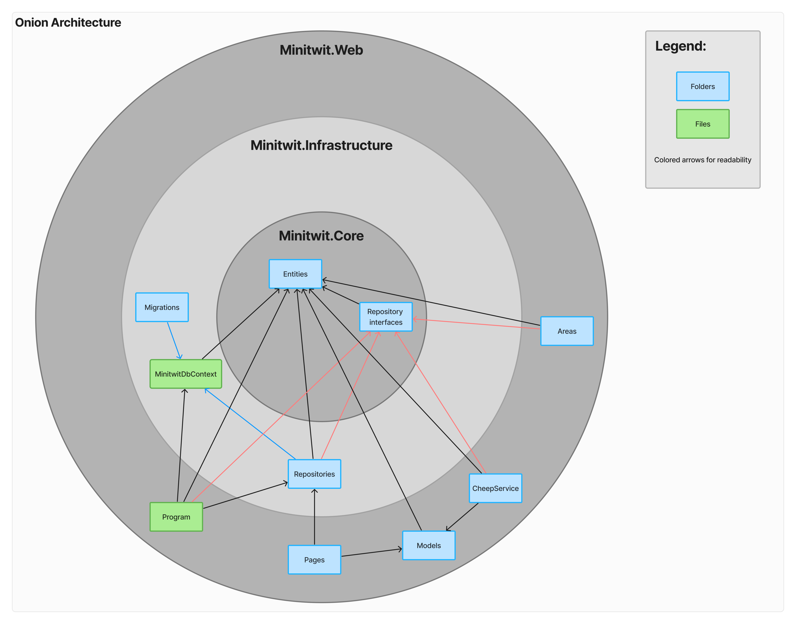
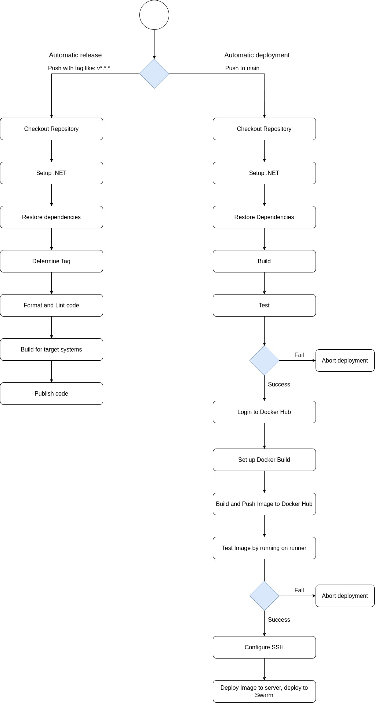
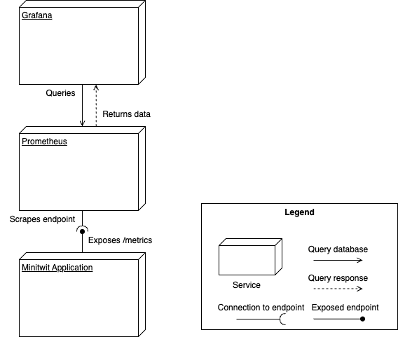

= Report - DevOps 2024 ITU
Casper Holten <casho@itu.dk>; Mads Dalgaard Andersen <madsd@itu.dk>; Magnus Kristensen <bekr@itu.dk>; Mikkel Kristensen <mbek@itu.dk>; Oliver Laursen <olau@itu.dk>
:title-page:
:appendix-caption:
:sectnums:
:toc:
:docdate: date (ISO)

== Introduction

During the DevOps, Software Evolution, and Software Maintenance course, we enhanced a 'Micro Blogging Service' from an earlier course to handle real-world user simulations. This process improved the application's durability, performance, and maintainability. We learned to create more efficient applications, implement robust CI/CD workflows, and use metrics, monitoring, and logging to maintain application health.

== System's Perspective
=== Design and Architecture of ITU-MiniTwit Systems

// Description and illustration of the design and architecture.

// Figures:
// SHOW THE ENTIRETY OF THE ARCHITECTURE(ZOOMED COMPLETELY OUT)
//SHOULD ACT AS THE BASIS FOR THE FIGURES BELOW (ZOOMED IN)
==== Overall Architecture

.Architecture Overview
image::Images/Architecture.png["System Architecture Diagram", align="center", width="90%, height="90%"]
The system architecture of the MiniTwit project is depicted in figure 1.

. *Development and Source Code Management*: Developers manage the source code locally and on GitHub, which includes a Vagrantfile for environment setup.

. *CI/CD Workflows*: Pushing changes to the main branch triggers GitHub Workflows, defined in .yml files, to handle build, test, release, and deployment.

. *Containerization and Delivery*: Workflows build the Minitwit Docker image, push it to Docker Hub, and pull Prometheus and Grafana images for deployment.

. *Provisioning and Deployment*: GitHub Actions provision virtual containers on DigitalOcean. Containers run a Minitwit swarm and a MySQL DBMS.

This architecture automates continuous integration, delivery, and deployment using GitHub, Docker, and DigitalOcean.

==== Onion Architecture

.Onion Overview

As shown in Figure 2, the source code consists of three main layers: Core, Infrastructure, and Web. The innermost layer, Core, is the domain model. Infrastructure contains the business logic, and Web holds the user interface. Each layer depends only on the inner layers, enforcing a clear separation of concerns and simplifying dependency management and testing.

<<<

==== Digital Ocean

.Digital Ocean Overview
image::Images/DigitalOceanVContainers.png["Digital Ocean Architecture Diagram", align="center", width="60%, height="60%"]

The Digital Ocean architecture, shown in Figure 3, consists of VContainers provisioned by the Vagrantfile during deployment, running the Minitwit swarm. Managed by Docker Swarm, the swarm ensures high availability, load balancing, fault tolerance, and scalability. It connects to a single container running a MySQL DBMS for data storage. This setup ensures the application can handle increased traffic and remain operational despite node failures.

=== Dependencies of ITU-MiniTwit Systems

// List and brief description of all technologies and tools applied and depended on.
The ITU-MiniTwit system leverages various technologies and tools for development and runtime:

* *ASP.NET Core*: Implements the web server, user authorization, identification, and minimal web API.
* *Entity Framework*: ORM for database abstraction and CRUD operations.
* *Playwright*: Enables end-to-end (E2E) tests.
* *Prometheus*: Collects and queries metrics as a monitoring system and time-series database.
* *Grafana*: Visualizes Prometheus metrics.
* *New Relic*: Collects, stores, and visualizes logs.
* *Xunit*: Library for integration and unit testing.
* *Coverlet*: Determines code coverage in tests.
* *Moq*: Generates mock objects for unit testing.
* *Docker*: Containerizes the application.
* *Docker Hub*: Stores and shares Docker images.
* *Digital Ocean*: Hosts the application.
* *Vagrant*: Provisions and manages virtual machines.
* *GitHub*: Manages source code and tasks.
* *GitHub Actions*: Automates CI/CD workflows.
* *GitHub Copilot*: AI assistant for code completion and generation.
* *ChatGPT*: AI assistant for code completion and generation.

Read more about AI assistants in the section <<Use of AI-Assistants>>.

<<<

=== Important Interactions of Subsystems
// Description of important interactions of subsystems.

.User Request Sequence via UI

.Successful simulator API request to public timeline
["Simulator Request Sequence Diagram", align="center", width="100%, height="100%"]

//Sequence Diagram / Flow Diagram from one subsystem to another
//Contain 2 start nodes, one for the user request and one for the simulator request

<<<

=== Current State of Systems

//Describe the current state of your systems, for example using results of static analysis and quality assessments.
.Static Analysis Results

MiniTwit systems are currently running smoothly. Static analysis only detects minor issues, such as repeated string literals and long methods. Importantly it detects no security issues.

//Run static analysis tools and describe the results

== Process' Perspective

=== CI/CD Chains

.Continuous Deployment chain

To easily and automatically deploy our application to our servers, we made use of the automatic deployment workflow as seen in 
figure 4. 
When a push to main with a tag is made, a workflow is triggered. This workflow builds and packages our application in appropriate
ways for selected runtime targets.

In general, when a push is made to main, the system is tested, and a Docker Image is compiled, tested and uploaded to Docker Hub. This image is then downloaded to the Swarm Manager,
and deployed to across Swarm.

To serve as a quality gate when reviewing pull requests, we also made use of a testing workflow. This workflow did not 
ran the tests written for the application, but did not abort any of our processes. This
served only as an indicator for program correctness when reviewing code. 

=== System Monitoring

.Monitoring view

The above graph depicts an abstracted view of the dataflow in the project's monitoring system.

* The Minitwit Web Application exposes ASP.Net metrics as well as the custom metrics seen in <<Custom metrics>> to the "/metrics" endpoint.
* The prometheus server scrapes the "/metrics" endpoint every 15 seconds and stores it in a database.
* Grafana queries the database, and displays the data in a custom dashboard as seen below.

.Grafana Dashboard

// Description of how the systems are monitored and what is monitored.

=== System Logging

We initially tried deploying the ELK stack for logging and monitoring but faced difficulties. We then chose New Relic, which logs everything written to the node's console, similar to local debugging. It captures stack traces, exception messages, and preceding events when requests fail, allowing us to monitor API access, track server actions, and identify errors.

The aggregated logs were sent to New Relic and were accessible through their proprietary dashboard.

=== Security Assessment

// Brief results of the security assessment and description of how the system security was hardened.
The team identified three major security threats through risk assessment, detailed in the <<Risk Assessments>> chapter of the Appendix. Although addressed, these threats were underprioritized due to project time constraints and the low probability of an attack. 

=== Scaling and Upgrade Strategy

// Description of the applied strategy for scaling and upgrades.
For scaling the application, Docker Swarm's horizontal scaling was employed, offering improved availability, load balancing, and fault tolerance. By distributing containers across multiple nodes, Docker Swarm ensures seamless handling of increased traffic and continued operation despite node failures. Leveraging Docker's ecosystem familiarity, Docker Swarm was a logical choice for efficient management and scaling of containerized applications.

Rolling updates were chosen as the deployment strategy due to alignment with existing infrastructure and minimal downtime. This approach updates services incrementally, maintaining continuous availability without requiring additional resources. While the Blue-Green upgrade strategy was considered, its additional resources and implementation time led the team to favor Rolling Updates. (<<szulik_2017>>)

=== Use of AI-Assistants
==== AI-assistants used

* OpenAI's ChatGPT version 3.5, 4.0.
* GitHub Copilot

==== Main uses

* *Breaking down code logic*: ChatGPT helped translate Python API controllers into C# and understand endpoint data.
* *Code completions*: GitHub Copilot assisted with auto-completing simple code snippets.
* *Research*: ChatGPT was also used to provide a secondary explanation when researching new technologies, in situations were the documentation either was difficult to understand, or if subsidary information was needed. 
* *Stacktrace breakdowns*: ChatGPT was used to breakdown stracktraces, summarizing the information as well as providing a more user-friendly format to read. 
* *Optimization*: Identifying functions for optimization.

==== Downsides

* Both tools are flawed and may require double-checking outputs, sometimes defeating their purpose.
* If not carefully inspected, AI-assistants may introduce bugs due to misunderstanding context.

// Description of the use of AI-assistants during the project.

== Lessons Learned Perspective

=== Evolution and Refactoring

// Description of the biggest issues, how they were solved, and lessons learned.
//Figures - maybe depict the change in structure
==== Cartesian Explosion
Due the project being based on a former course project, some flaws were brought in from the start of the course. One of which was a cartesian explosion caused by navigation properties used by EF Core, which is a common issue with ORMs. The issues were fixed by refactoring the Author-, Cheep-, CreateCheep-, Follow-, and reaction-entities to only contain ID's to other entities, instead of containing a reference to the entity itself. Furthermore, unnecessary relations between entities were removed, such as the Author-entity containing a list of all Cheeps they've created. 

==== Lessons Learned
As a consequence of identifying the presence of the Cartesian explosion, it became evident that the database design was significantly suboptimal. This led to the realization that the database design should be thoroughly planned before implementation, to avoid potential performance issues and scalability problems. 

==== Performance issues and subsequent server crashes

===== Long running asynchrous operations

Throughout most of the project, we experienced issues related to scaling the application.
These scaling issues were not related to horizontal scaling, but were fundamental flaws in the code.

One of the earliest performance issues were bugs related to asynchronous function calls in the code. A few asynchronous 
calls were missing await statements, and could thus, potentially, run indefinitely. This would lead to more and more
Database connections in the database being occupied, without ever being released. After some hours, this would lead to a crash
of the webserver. Normally the database would have 1-8 threads used, but with the emergence of this issue, the amount of used database
threads could rise to 70+ at any given time, thus overwhelming the database.

===== High amount of database roundtrips

Mitigating the exhaustion of the connection pool to the database solved our stability issues for some time.
With the onset of the 3rd round of the simulator, and the subsequent rise in request/second, our application experienced new issues.
Requests would be processed too slow, resulting in the requester cancelling the request, thus giving us HTTP 499 errors.
This was solved by increasing the amount of concurrency in our application code, and reducing the amount of separate database queries made.
We identified a function, that resulted in 32 different database requests. We bundled these 32 requests into a single query, thus eliminating
a lot of redundant network roundtrips and performance degradation that stems from having to process many different requests compared to one.

This brought the performance of the application to an acceptable level, and resulted in the 499 errors disappearing.

===== Lessons learned

It became obvious that horizontal and horizontal scaling cannot always be used to mitigate performance related issues. Sometimes
the codebase is unoptimised in a way, where scaling cannot solve the underlying performance issue. 

High performance and well-designed systems are integral for scalability, since problems introduced by sloppy implementations 
can be impossible to solve once transitioning to operations and maintenance. 

=== Maintenance

==== Challenges

One of the primary challenges encountered during the maintenance phase was identifying the root cause of unintended behaviour. This encompassed several aspects:

*Primary Challenges*:

* **Error Detection**: Determining the root causes of errors in the system, and capturing the stacktrace and error messages associated with these.

* *System Status*: Monitoring website status and instances of downtime.

* **Issue Diagnosis**: Pinpointing failures and malfunctions attributed to unintended behaviour of the subsystems.

Initially, all the described issues were solved in inconvenient and time-consuming manners. In the beginning, we relied on primitive tools
like logging exceptions to text files, and observing console logs for errors as they occur in real time. 

==== Solutions Implemented

* *Monitoring Systems*: Integrated Prometheus and Grafana for real-time performance observation and configured alerts.
* *Logging Mechanisms*: Established detailed logging with New Relic for systematic error recording and analysis.
* *Integrated New Relic*: Integrated New Relic's Application Performance Monitoring tool, allowing us to view aggregated log, error, and performance metrics.  

These tools significantly enhanced our ability to manage and maintain the system effectively. Real-time insights and detailed 
logs provided a clearer picture of the system's operational state, enabling proactive and reactive maintenance, and faster response times.

==== Outcomes

The logging and monitoring tools did not completely eliminate instances of downtime, but it considerably reduced their duration.

* *Improved Error Tracking*: Enhanced ability to trace and resolve errors.
* *Proactive Maintenance*: Detecting potential issues before escalation.
* *Efficient Response*: Faster response times with traceable exceptions and comprehensive log data.

==== Lessons Learned

* *Scope of Maintenance*:
Maintenance is inherently a substantial and ongoing task that demands continuous attention and resources.

* *Utility of Monitoring and Logging*:
Effective monitoring and logging are critical components of a robust maintenance strategy. They provide essential visibility into system operations, aiding in quick issue identification and resolution.

* *Continuous Improvement*:
Maintenance processes should be continually refined to adapt to evolving system requirements.

== DevOps Style of Work
//Also reflect and describe what was the "DevOps" style of your work. For example, what did you do differently to previous development projects and how did it work?
As the entire team has been taking the course "Second Year Project: Software Development in Large Teams" which introduces working by the Agile principles and with Scrum as a framework, it's only natural that some elements have been taken into the project especially since these frameworks align well with the DevOps style of work as shown in table 7 of <<jabbari_2016>>. 

The effects of learning Scrum seeped into the working style of the team, not by introducing scrum events and the like, but by using the 3 pillars of Scrum; Adaptation, Transparency, and Inspection as guidelines (<<scrum_guide_2020>>). Each Friday the team held physical meetings, where the state of the project was discussed, keeping each member up to date while answering questions any member might have. Breaking down the work each week, increased understanding of the project, transparency, and ensured openness amongst the team. 
GitHub allowed for fine-grained inspection through peer-reviewed code inspections facilitated with Pull requests. GitHub also provided a Kanban board to showcase the backlog, as well as the status of ongoing work. 

In the same way the agile principles were introduced to the project. Of the twelve principles; "Welcome changing requirements" (<<agile_principles_2001>>), was the most prevalent as new requirements were added almost weekly. Furthermore how to meet those requirements wasn't set in stone. In situations where the team would find a better way to fulfill a task, there would be little resistance to incorporating it into the project. 

Another vital principle was; "The most efficient and effective method of conveying information to and within a development team is face-to-face conversation"(<<agile_principles_2001>>). To implement this principle, the team had both the weekly physical meeting, but would routinely also hold pair-/ or mob-programming sessions. The latter part, contributed to increasing the ownership of the codebase, generally raises the quality of the code produced, and minimises the time spent on code inspections. (<<Pair_Programming_2009>>)

== Conclusion

In conclusion, the DevOps, Software Evolution, and Software Maintenance course enabled the team to enhance the MiniTwit application through real-world user simulations, improving durability, performance, and maintainability. Implementing CI/CD workflows, containerization, and effective monitoring and logging strategies streamlined deployment and maintenance. Addressing challenges like performance issues and security risks deepened the team's understanding of scalable, efficient systems. Adopting DevOps principles facilitated collaboration and continuous improvement, ensuring the applications robust performance and reliability.

<<<

// Brief conclusion of the report.
[appendix]
== Appendix

=== Custom metrics

|===
|Metric |Description

|minitwit_api_requests_total
|The total amount of API interactions received.

|minitwit_api_requests_error_total
|The sum of all API errors. 

|minitwit_api_requests_success_total
|The sum of all succesful API requests handled. 

|minitwit_register_user_total
|The sum of registered users received through the API.

|minitwit_login_user_total
|The sum of login requests received through the API. 

|minitwit_follow_user_total
|The sum of follow requests received through the API. 

|minitwit_unfollow_user_total
|The sum of unfollow requests received through the API. 

|minitwit_post_message_total
|The sum of posted cheeps through the API. 

|minitwit_get_messages_total
|The sum of requests to view cheeps received through the API. 

|===

=== Risk Assessments

==== HTTP Transfer Protocol
*Risk Identification*

Assets:

This threat concerns the Web Application, as well as services that communicate over the Web Application. 

Identify threat source:

* The Web Application uses HTTP as Transfer protocol

Construct risk scenarios:

A malicious person gains access to a session, and from there have multiple ways to cause harm;

* As the messages aren't encrypted in HTTP they can eavesdrop on messages sent between a client and the server.
* They can create man-in-middle attacks, potentially tampering with the data sent between server and client.

*Risk Analysis*

Determine likelihood:

As the team consists of relatively unknown developers, and the project is a course-project with no real users or data, the motivation for attacking the system is low. 
However there are multiple guides online on how to commit such an attack, making it accessible for any user with basic knowledge about Network communication. 

Improve the security of our system:

The best course of action would be set up the HTTPS for the web application and redirect the Users to that endpoint. This requires that a SSL certificate gets registered an activated. 

==== Database Credentials
*Risk Identification*

Assets:

This threat concerns the Database, and the nodes which the database is hosted on. 

Identify threat source:

* The credentials for the database is saved in a ".env"-file, which is distributed to any node on which the database runs. 

Construct risk scenarios:

A malicious hacker forces himself into the filesystem of a Node, there they could find ".env" file, giving them multiple options of causing harm including;

* Dropping the database
* Holding the data ransom
* Tampering with the User's data
* Utilizing User data to cause problems for the Users
* Leaking data

*Risk Analysis*

Determine likelihood:

As mentioned in the previous risk assessment <<HTTP Transfer Protocol>>, the motivation for causing such an attack is low. 
Compared to the previous threat, this attack requires more orchestration and skill as the hacker would have to gain access to the Node, and know what to look for. 

Improve the security of our system:

There are multiple options to remove this threat, such as any service providing 2FA for secret repositories, like Docker vaults.

==== Database back-up
*Risk Identification*

Assets:

This threat concerns the database.

Identify threat source:

* There's no virtual or physical back-up copy of the state of the database. 

Construct risk scenarios:

* In lue of the threat from <<Database Credentials>>, there wouldn't be a way to restore data if a person with malicious intent gained access to a database node, found the credentials and removed data. 

*Risk Analysis*

Determine likelihood:

The likeness of this happening, would be the same as for the <<Database Credentials>> threat. 

Improve the security of our system:

There are many options as to how to improve on this threat. A minimum effort would be to have physical copy of the state of the database on one or more harddrives. DigitalOcean has a Collaboration with SnapShooter, a service that enables virtual backups of databases, that would integrate nicely into the project. 

<<<

[bibliography]
== References

[[Pair_Programming_2009]] Jo E. Hannay, Tore Dybå, Erik Arisholm, Dag I.K. Sjøberg,
The effectiveness of pair programming: A meta-analysis,
Information and Software Technology,
Volume 51, Issue 7, 2009, Pages 1110-1122,
Accessed May 23, 2024.,
https://www.sciencedirect.com/science/article/pii/S0950584909000123

[[szulik_2017]] Szulik, Maciej. “Colorful Deployments: An Introduction to Blue-Green, Canary, and Rolling Deployments.” Opensource.com. Accessed May 23, 2024. https://opensource.com/article/17/5/colorful-deployments. 

[[scrum_guide_2020]] “The 2020 Scrum GUIDETM.” Scrum Guide | Scrum Guides. Accessed May 23, 2024. https://scrumguides.org/scrum-guide.html. 

[[agile_principles_2001]] Principles behind the Agile Manifesto. Accessed May 23, 2024. https://agilemanifesto.org/principles.html. 

[[jabbari_2016]] (PDF) what is devops?: A systematic mapping study on definitions and practices. Accessed May 22, 2024. https://www.researchgate.net/publication/308857081_What_is_DevOps_A_Systematic_Mapping_Study_on_Definitions_and_Practices. 